# leolink

A native Linux client for Reolink cameras. Qt 6, C++20, libmpv.

Talks to cameras over their own protocols — the HTTP API, RTSP and ONVIF on the
local network — so nothing has to be installed on the camera and no vendor
software is involved.

> Not affiliated with, endorsed by or supported by Reolink.

---

## What it does

- **Several cameras at once** in a grid you arrange yourself. A camera can cover
  more than one cell (2×1, 1×2, 2×2 …), or be placed automatically.
- **Volume and mute per camera**, because eight rooms at once is not a feature.
- **Motion alerts** either from the camera over ONVIF, or worked out here from
  the picture — for cameras that report nothing. The local detector takes
  drawable zones, so a tree in the wind or a neighbour's door can be left out.
- **Sound detection** with a threshold in dBFS, for what the picture misses.
- **Records to your own disk** — on motion or at the press of a button. Works
  on cameras with no SD card, because the recording happens here. A separate
  ffmpeg process copies the stream through without re-encoding, so quality is
  untouched and the processor stays idle.
- **Changes settings on the camera**: resolution, frame rate, bit rate, H.264
  profile and the picture controls. Every choice offered is one the camera
  itself reported, so no model is shown an option it cannot do. Also the
  camera's own detection area drawn on a live picture, its weekly schedules for
  detection and recording, sensitivity by time of day, privacy areas it blanks
  before anything leaves the device, users, Wi-Fi, firmware and a restart.
- **Reacts to events**: run a command, call an HTTP endpoint, publish MQTT.
  Configure it once globally or per camera.
- **Event log** with the still and recording captured at the time, filterable
  per camera.
- **Finds cameras** on the network by ONVIF discovery.
- **Fits the desktop**: follows the system light/dark palette, tray icon,
  hideable menu bar and window decoration for wall displays.
- **Recordings on the camera's SD card**: search by period, play, download.
- **Any RTSP source**, not only Reolink — the custom-URL transport takes
  anything libmpv can open.
- **Four ways to get the picture**: RTSP, HTTP-FLV, the camera's own Baichuan
  protocol, or a URL of your own. Baichuan is the answer for cameras that keep
  RTSP switched off, and it does not consume one of the camera's few web
  sessions.
- **Diagnostics that can be handed to somebody else.** Errors and warnings are
  always recorded; switching on detailed logging adds the whole conversation
  with the camera. Help ▸ Diagnostics shows it, filters it, and copies a report
  with the machine's details attached — **passwords, session tokens and public
  addresses removed before anything is written**, so it can be pasted into a bug
  report as it stands.
- **English and German.**

## What it looks like

Real screenshots of the application running. The camera tiles play freely
licensed photographs rather than anybody's front door — see
[docs/screenshots/CREDITS.md](docs/screenshots/CREDITS.md) for where those come
from and what was blurred.

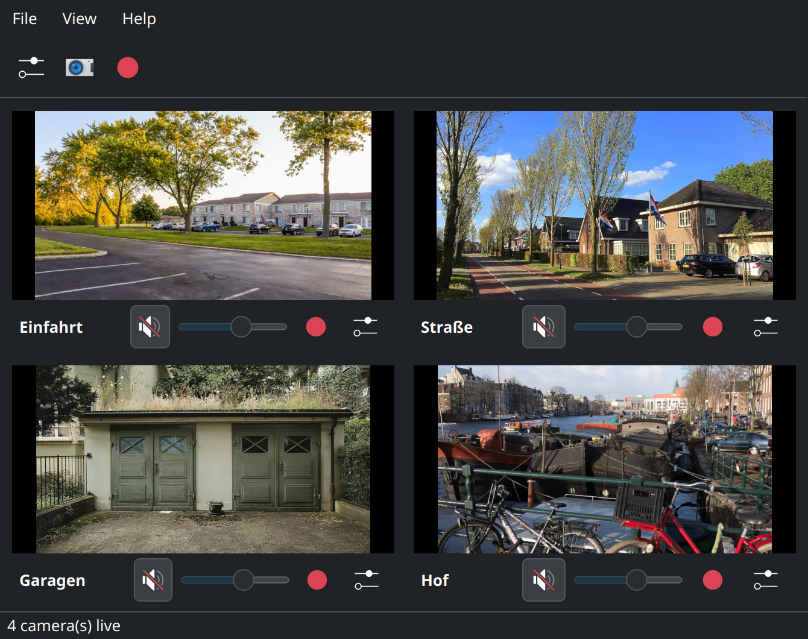

### Settings

| | |
|---|---|
| 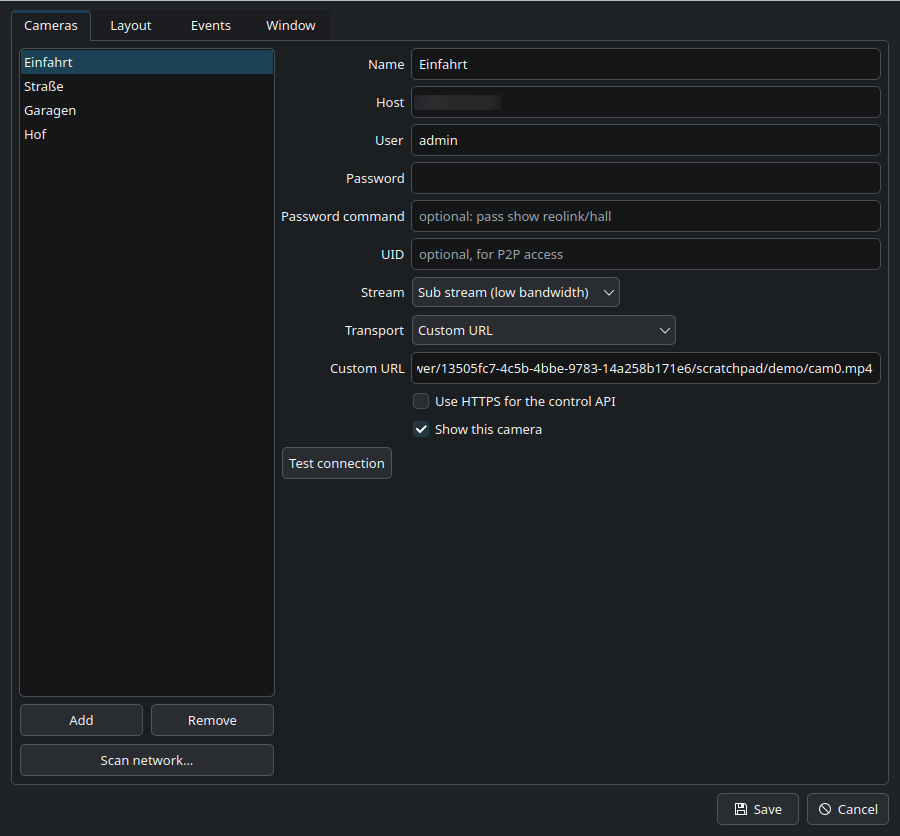 | 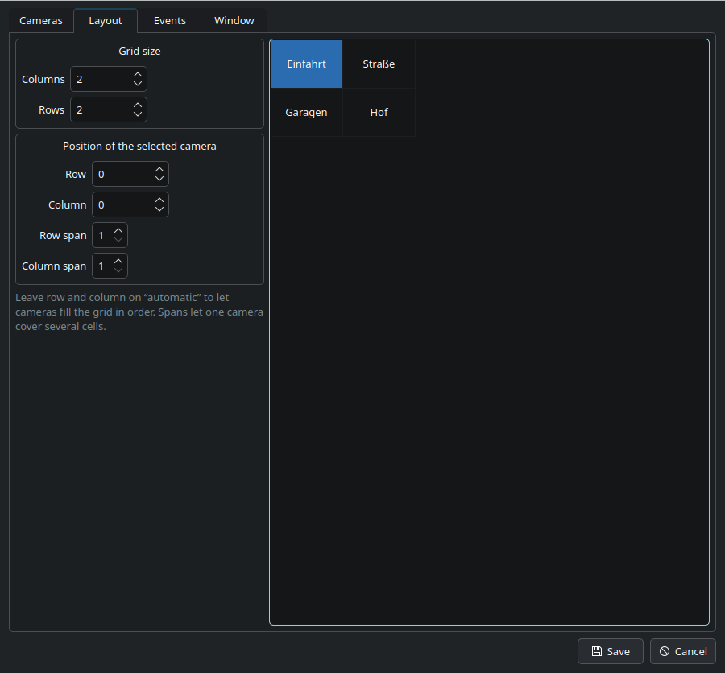 |
| **Cameras** — address, credentials, stream and transport | **Layout** — the grid, and which cell a camera occupies |
| 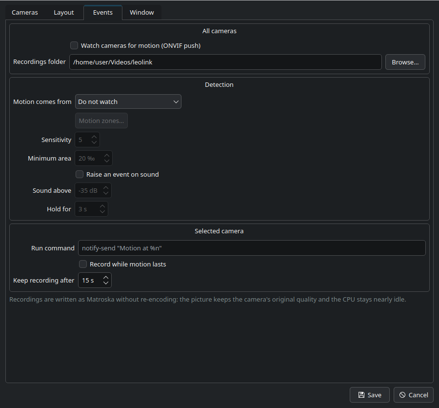 | 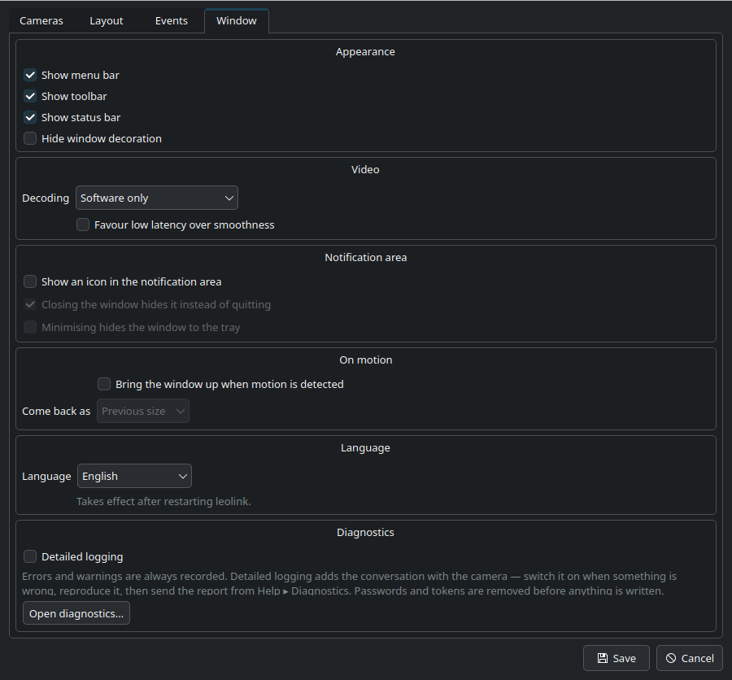 |
| **Events** — what counts as motion and what happens then | **Window** — chrome, tray, language, decoding, diagnostics |

### Camera settings

Everything here is built from what the camera itself reports, so a model that
cannot do something simply does not show it.

| | |
|---|---|
| 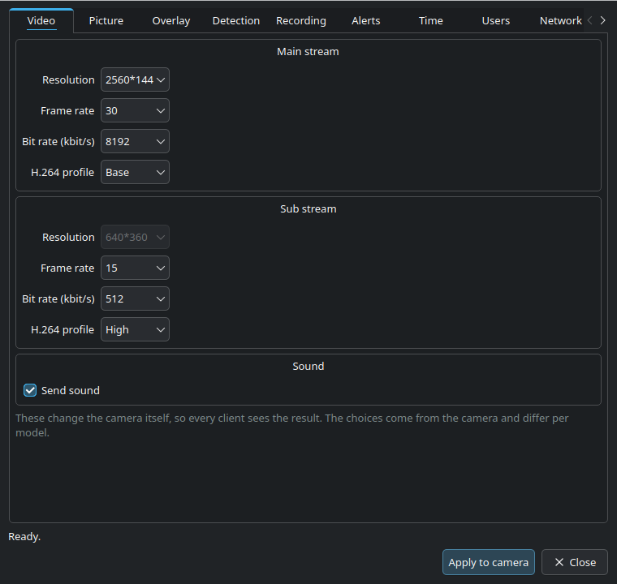 | 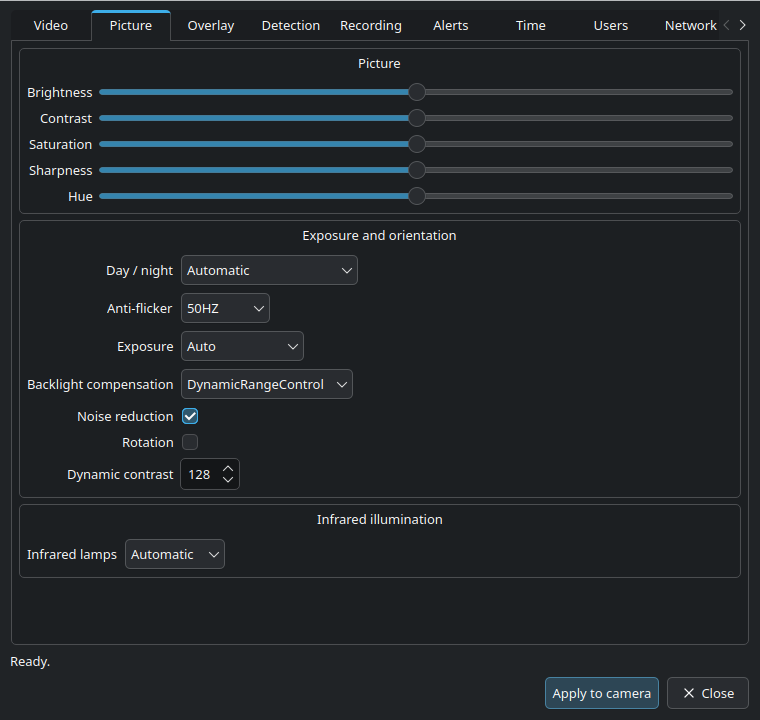 |
| **Video** — resolution, rate, bitrate, profile, microphone | **Picture** — brightness, contrast, day/night, infrared |
| 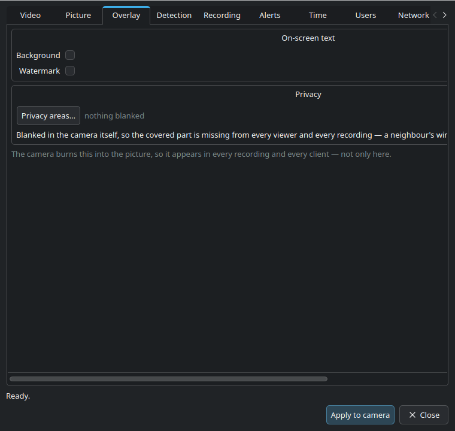 | 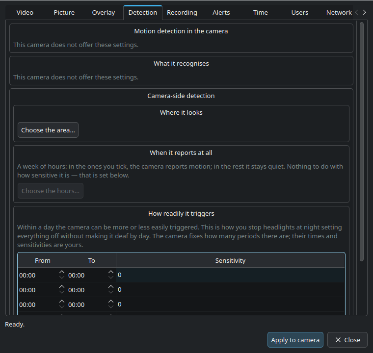 |
| **Overlay** — on-screen text, and the privacy areas the camera blanks | **Detection** — where it looks, when it reports, how readily it triggers |
| 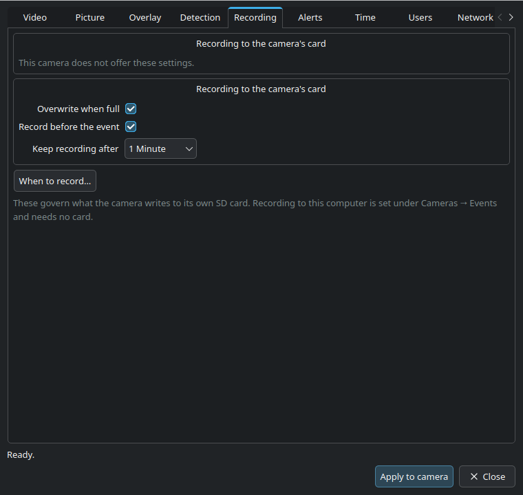 | 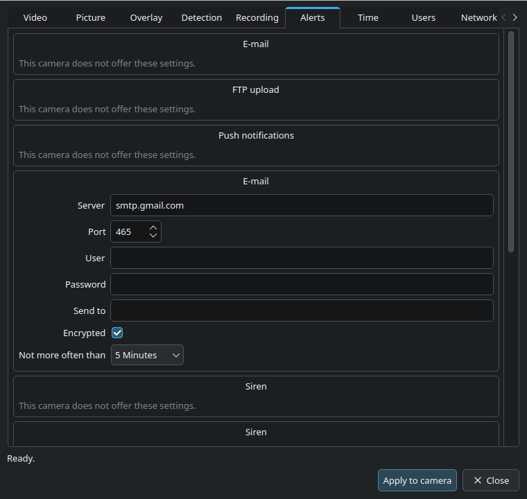 |
| **Recording** — to the camera's own card, and when | **Alerts** — e-mail, FTP, push, siren and spotlight where fitted |
| 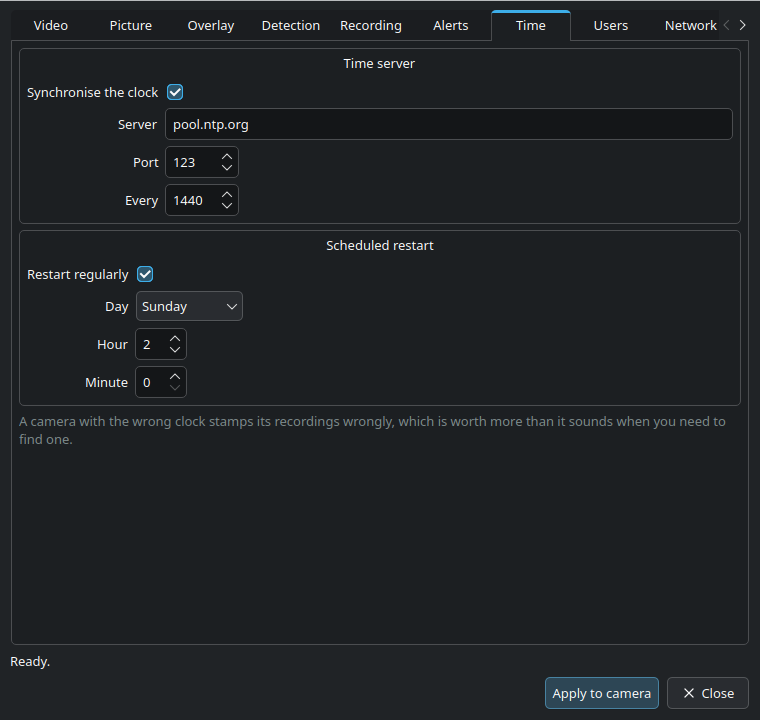 | 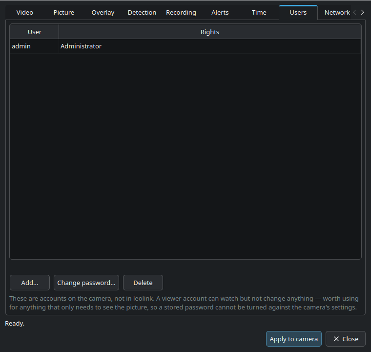 |
| **Time** — clock, time zone, NTP | **Users** — add, remove, change passwords |
| 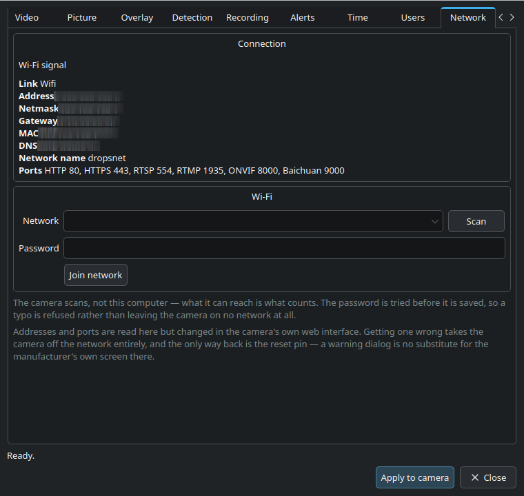 | 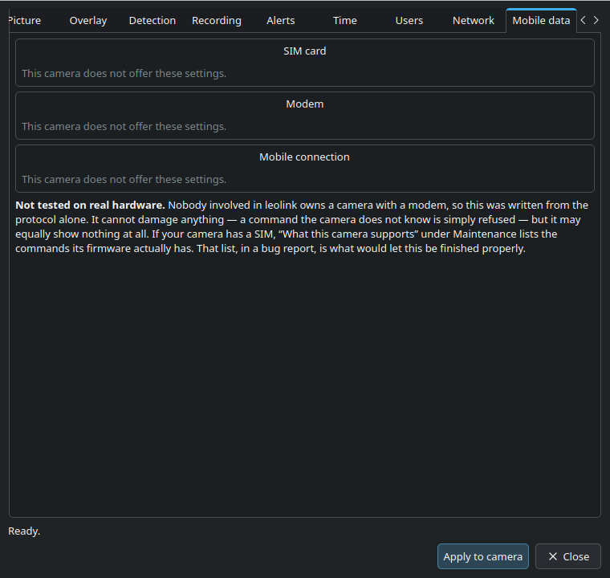 |
| **Network** — link, addresses, ports, Wi-Fi | **Mobile data** — SIM and modem, on cameras that have one |
| 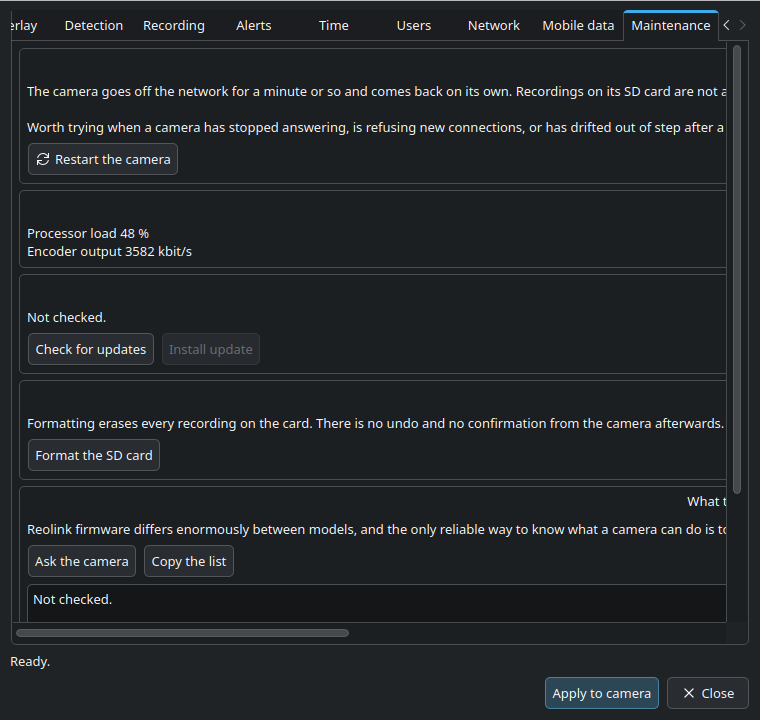 | |
| **Maintenance** — condition, firmware, storage, and what this camera supports | |


## Requirements

Qt 6.4 or newer and libmpv. `ffmpeg` on PATH is needed for recording — without
it everything else still works and recording reports that it is unavailable.

A graphics stack with VA-API or VDPAU is optional but worth having for
main-stream resolutions.

## Building

```bash
sudo apt install cmake ninja-build qt6-base-dev qt6-svg-dev qt6-tools-dev \
                 qt6-tools-dev-tools libmpv-dev

cmake -S . -B build -G Ninja -DCMAKE_BUILD_TYPE=Release
cmake --build build
./build/leolink
```

Install system-wide, with the desktop entry and AppStream metadata:

```bash
sudo cmake --install build
```

Build a `.deb`:

```bash
cd build && cpack
```

## Configuration

Settings live in `~/.config/leolink/config.json`, mode 600. The file holds
camera passwords in clear text; if that bothers you, leave the password empty
and set a **password command** instead — leolink runs it and reads the secret
from its output:

```
pass show reolink/hall
secret-tool lookup service reolink host 192.168.1.10
```

Recordings and event stills go to `~/Videos/leolink` unless told otherwise.
The event log is `~/.local/share/leolink/events.jsonl`, one JSON object per
line, and is pruned to 90 days on start.

## Keyboard

| | |
|---|---|
| `Ctrl+M` | menu bar on/off |
| `Ctrl+Shift+D` | window decoration on/off |
| `Ctrl+S` | snapshot every camera |
| `Ctrl+R` | start/stop recording every camera |
| `Ctrl+L` | event log |
| `F11` | full screen — the whole grid, every bar hidden |
| `Esc` | leave full screen |
| double-click a tile | that camera alone fills the screen, again to go back |
| right-click | menu — also the way back when everything else is hidden |

In full screen the controls under each camera withdraw a few seconds after the
pointer stops, and the pointer goes with them; moving it brings both back.

With the decoration hidden, drag the strip beneath any camera to move the
window.

## Event placeholders

Available in commands, webhook bodies, MQTT topics and payloads:

| | |
|---|---|
| `%n` | camera name |
| `%i` | camera id |
| `%h` | host |
| `%t` | ISO 8601 timestamp |
| `%e` | event type |
| `%s` | `on` / `off` |
| `%f` | recording file, if one was started |
| `%p` | still image file |

With no webhook body or MQTT payload given, a small JSON document describing the
event is sent instead.

## Protocols

The reverse engineering behind this is written up in
[docs/protocol.md](docs/protocol.md): the HTTP CGI API and its error codes, the
streaming paths, ONVIF's two firmware quirks, and the Baichuan protocol on port
9000 including its four-message login handshake.

Baichuan is not needed for ordinary viewing of a wired camera. It matters for
battery models that keep RTSP switched off, for reaching a camera by UID from
outside the network, and for two-way audio.

## Status

Developed against an **RLC-410W**. Other Reolink models speak the same
protocols, and leolink asks each camera what it supports rather than assuming.

Verified against real hardware: the HTTP API, RTSP and HTTP-FLV streaming,
snapshots, ONVIF discovery and motion push, and Baichuan — login *and* video.
The Baichuan container was worked out from a capture rather than from the
published notes, which have the block magics byte-reversed; see
[docs/protocol.md](docs/protocol.md). Measured on the sub stream: 150 frames in
ten seconds, 640x352 High profile, no decode errors.

Writing settings was tested by round trip — read a section, write it back
unchanged, confirm the camera accepts it. That is what caught `SetAlarm`
refusing the very value `GetAlarm` had just returned; the detection area, the
schedules and the sensitivity bands were then verified by editing one, reading
it back changed, and restoring it.

Packaging: `.deb`, `.rpm`, AppImage and Flatpak all build. The Flatpak
compiles libplacebo, libass and libmpv from source against the KDE runtime and
picks libmpv's LGPL configuration, so the bundle does not impose GPL terms.

The local motion detector was checked against both a busy scene and a still
one: traffic footage changed 6.3% of watched pixels on average, a static camera
0.00% with a peak of 0.03%. The default threshold of 15‰ sits between the two
with room to spare.

Not yet verified, because the test camera cannot: **playback from the SD card**
(none fitted, so every search answers -17), the **P2P path** (no P2P-capable
camera here) and **mobile data** (no camera with a modem). All three are
implemented from the documented protocol and report what the camera actually
said rather than guessing, so a first run on real hardware should show plainly
where reality differs.

If you have such a camera, two things would genuinely help: the output of
`leolink --baichuan-p2p <UID>`, and — for an LTE model — the list from
**Maintenance ▸ What this camera supports**, which asks the camera which
commands its firmware actually has. Guessing at command names from here is the
only reason the mobile-data screen is marked untested.

One thing that could not be established from here: **which weekday the camera's
168-character schedule starts on.** It is 7×24 and Monday-first is the ISO
convention, so that is what the editor labels. A schedule cannot be read back in
a form that reveals the order, and this camera's web interface has no schedule
screen to compare against. If your recordings land a day out, say so — it is one
constant in `CameraSettingsDialog.cpp`.

Missing before a Flathub submission: **screenshots**. They must not show a real
camera feed; add a camera with the custom-URL transport pointing at freely
licensed footage, then capture the window.

Two-way audio is not implemented. Baichuan carries it and the transport is now
in place, so it is the obvious next thing.

## Credit

The Baichuan protocol was originally reverse engineered by
[thirtythreeforty/neolink](https://github.com/thirtythreeforty/neolink), now
maintained at
[QuantumEntangledAndy/neolink](https://github.com/QuantumEntangledAndy/neolink).
Their Wireshark dissector made the port-9000 work here a matter of hours rather
than weeks.

## Licence

MIT. See [LICENSE](LICENSE) — which also spells out what the Qt and libmpv
licences mean for redistributed binaries.
